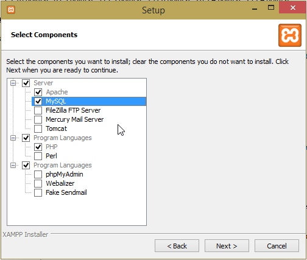
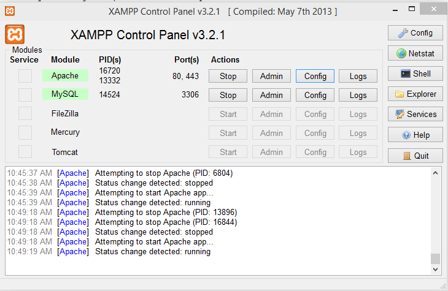

Deploy to Windows
=================
##Install the Webserver

For simplicity we are using all 32-bit packages. XAMPP and the mysql-python libraries do not have 64bit versions

###Overview
 1. Install Python
 2. Install XAMPP
 3. Clone Repo
 4. Generate Virtualenv
   - install pip using get-pip.py
   - install virtualenv using pip
   - install mysql-python
   - generate a virtualenv
   - use the bash script to install mysql-python in virtualenv
   - install other requirements
 5. Add the Apache Module mod_wsgi
 6. Configure Apache

###Install Python
Download and install [Python](https://www.python.org/downloads/release/python-278/) (use the x86 MSI Installer)

###Install XAMPP
Download and install [XAMPP](https://www.apachefriends.org/download.html), XAMPP 1.8.3 used here. Not all of the components are nessasary.


###Clone Repo
Using whatever method you would like, get the `osusvt-telemetry` git repo inside of `C:\xampp\`

For Example, download the zip file from github and extract it to `C:\xampp\osusvt-telemetry\`

###Generate Virtualenv

####Install Pip
Download [get-pip.py](https://bootstrap.pypa.io/get-pip.py) and place it on the root of `C:` (easy to type into CMD)

Open CMD Prompt
```
C:\Python27\python.exe C:\get-pip.py
```
Pip should now be installed.

####Install Virtualenv

Using previous CMD Prompt
```
C:\Python27\Scripts\pip.exe install virtualenv
```

####Install mysql-python
Normally we install python packages using Pip. Sadly in order to install/compile mysql-python using pip we would need a variety of strange libraries. I was not able to figure it out, so we will use a pre-compiled .exe containing the needed information

Download and install [mysql-python](http://sourceforge.net/projects/mysql-python/), also provided in this folder.

####Build a virtualenv
Using previous CMD Prompt
```
cd C:\xampp\osusvt-telemetry\
C:\Python27\Scripts\virtualenv env
```
Test the virtualenv
```
env\Scripts\activate.bat
python
```
If you get to a python prompt, the virtualenv is installed
```
>>> exit()
```

####Copy mysql-python
We need to copy the mysql-python code that we installed into our virtualenv

Using previous CMD Prompt (if you closed it you will need to activate it again)
```
env\Scripts\activate.bat
```
Run the [mysql-python-virtualenv](https://gist.github.com/georgevreilly/8444988) script: (Also Available in this Folder)
```
deployment\windows\mysql-python-virtualenv.bat
```
MySQLdb should now be available, so we can remove it from the requirements.txt file
```
"C:\Program Files (x86)\Notepad++\notepad++.exe" requirements.txt
```
change `mysql-python` to `#mysql-python`

####Install remaining requirements
Using previous CMD Prompt (if you closed it you will need to activate it again)
```
env\Scripts\activate.bat
```
Install Packages using Pip
```
pip install -r requirements.txt
```

###Install mod_wsgi
Download the a copy of [mod_wsgi](http://www.lfd.uci.edu/~gohlke/pythonlibs/#mod_wsgi) that matches what we are using, `mod_wsgi‑3.5.ap24.win32‑py2.7.zip` used here. Also available in this folder.

Copy the `mod_wsgi.so` file to `C:\xampp\apache\modules\`

###Configure Apache
Use XAMPP Control Panel to open the httpd.conf file



Add the following to the end of the httpd.conf file
```
LoadModule wsgi_module modules/mod_wsgi.so
WSGIScriptAlias / C:/xampp/osusvt-telemetry/telemetry.wsgi
<Directory C:/xampp/osusvt-telemetry>
	Order deny,allow
	Allow from all
</Directory>
```
Find the text
```
<Directory />
    AllowOverride none
    Require all denied
</Directory>
```
Replace `Required all denied` with `Required all granted`

##Setup MySQL

Start mysql using xampp control panel

Open CMD Prompt
```
C:\xampp\mysql\bin\mysql.exe -uroot
```
This should open a mysql prompt, run the following commands to create the database and user
```
CREATE DATABASE telemetry;
CREATE DATABASE solarcar;
GRANT ALL ON *.* TO 'solar'@'localhost' IDENTIFIED BY 'Phenix';
```

###Build the solarcar database

Normally this step would not be nessasary, because the Tablet would create this database. However, if there is no database it will not run at all.

Download [telemetry.sql](http://web.engr.oregonstate.edu/~hoeftc/telemetry.sql) and place it on the root of `C:` (easy to type into CMD)

```
C:\xampp\mysql\bin\mysql.exe -uroot solarcar < C:\telemetry.sql
```

Success
=======
Start Apache and MySQL

Navigate to `http:\\localhost\` in your browser

The First time you go to the page it could take a long time for the page to load depending on how much information it need to grab

Troubleshooting
===============
1. Keep in mind that the first time you go to the web page it make take longer than usual because it initializing the code.
2. Try Launching Using Development Server (run `devrun.py` in virtualenv)
3. Look at the apache logs (Accessable using the XAMPP Control Panel)
4. Edit the config file to use mysql instead of sqlite
5. If you think there is a multiproccess problem, try running something like `python -e 'from app.sync import *; loop()'` to run the sync outside of the loop
